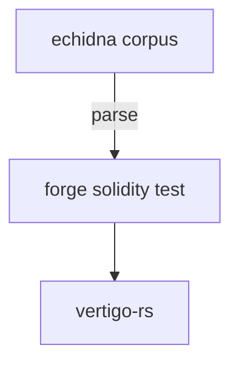

# echidna-mutator
Parse echidna corpus into a forge solidity test (to then conduct robustness analysis via mutation testing using vertigo-rs).

Basically, this will assess how exhaustive a corpus is (both from the echidna tests and the sequences saved).

for now, poc in python, will port to rust later